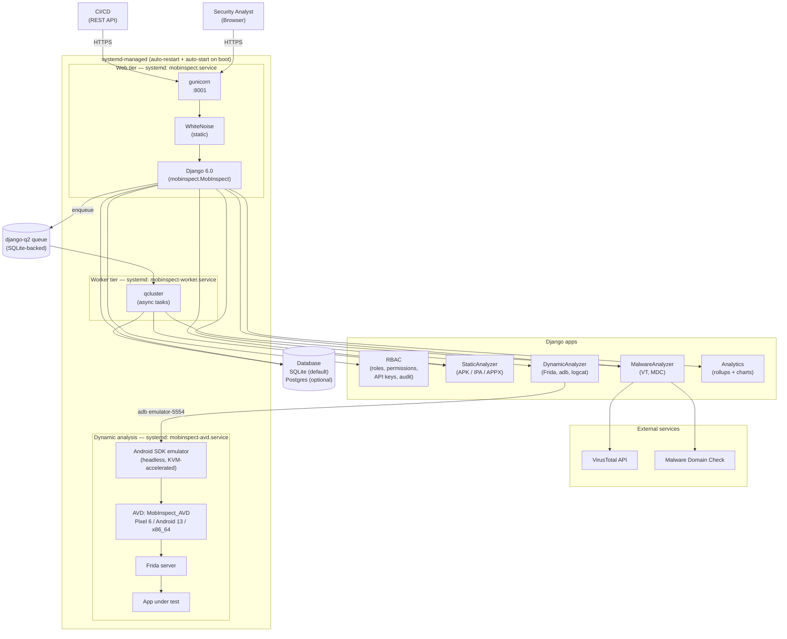

# MobInspect

> Self-hosted security analysis platform for Android, iOS, and Windows Mobile applications — an **Appdirs** project.

---

## Architecture



---

## Installation

Two paths: **local development** for hacking on the code, **production deployment** for running it as a service. The Gitea wiki has a more detailed [Installation guide](http://192.168.3.244:3000/Appdirs/Mobins/wiki/Installation).

### Prerequisites

| Tool | Version |
|------|---------|
| Python | 3.12+ |
| Poetry | ≥1.5 |
| Java JDK | 17+ (for JADX / apktool) |
| Git | any |
| (optional) Postgres | 14+ |
| (optional) Android SDK + AVD | for dynamic analysis — needs `/dev/kvm` |

### Local development

```bash
# 1. Clone (sparse-checkout if you want to skip the heavy emulator/ dir)
git clone http://192.168.3.244:3000/Appdirs/Mobins.git MobInspect
cd MobInspect

# 2. Python deps
poetry install

# 3. Tailwind CSS toolchain (downloads a self-contained binary — no Node.js)
./scripts/install-tailwind.sh

# 4. One-shot launcher: builds CSS, migrates DB, seeds RBAC, serves the UI
#    at http://127.0.0.1:8001/
./scripts/start.sh
```

Launcher environment variables:

| Variable | Default | Effect |
|----------|---------|--------|
| `MOBINSPECT_PORT` | `8001` | UI port |
| `MOBINSPECT_BIND` | `127.0.0.1` | Bind address (`0.0.0.0` to expose on LAN) |
| `MOBINSPECT_DEBUG` | `0` | `1` enables Django DEBUG (full tracebacks) |
| `MOBINSPECT_DEV` | `0` | `1` unblocks `runserver` for dev — never set in production |
| `MOBINSPECT_ALLOWED_HOSTS` | `127.0.0.1,localhost` | comma-separated Django `ALLOWED_HOSTS`; never wildcard in prod |
| `MOBINSPECT_BEHIND_TLS` | `0` | `1` turns on `Secure` cookies + HSTS — requires an actual TLS terminator in front |
| `MOBINSPECT_BEHIND_PROXY` | `0` | `1` makes Django honor `X-Forwarded-*` (set when behind nginx/Caddy) |
| `MOBINSPECT_ADMIN_USERNAME` | `admin` | initial superuser created by `manage.py bootstrap_admin` |
| `MOBINSPECT_ADMIN_PASSWORD` | _(generated)_ | password for that user; if unset, a 24-char `secrets.token_urlsafe` is generated and written to `~/.MobInspect/initial-admin-password.txt` (mode 0600) |

#### First-time admin

There are no longer any default seeded credentials — the upstream `mobinspect / mobinspect` superuser is gone. Bootstrap your first admin instead:

```bash
# Idempotent: re-runs are a no-op once any superuser exists.
poetry run python manage.py bootstrap_admin
# Then read the generated password (printed once at INFO):
cat ~/.MobInspect/initial-admin-password.txt && \
  shred -u ~/.MobInspect/initial-admin-password.txt
```

Or pass the credentials in directly so they never touch disk:

```bash
MOBINSPECT_ADMIN_USERNAME=superadmin \
MOBINSPECT_ADMIN_PASSWORD='<12+char-strong-password>' \
  poetry run python manage.py bootstrap_admin
```

### Production deployment (systemd)

```bash
# 1. Install system deps on Ubuntu 22.04+:
sudo add-apt-repository -y ppa:deadsnakes/ppa
sudo apt update
sudo apt install -y python3.12 python3.12-venv python3.12-dev \
                    openjdk-17-jre-headless build-essential \
                    libssl-dev libffi-dev zlib1g-dev libsqlite3-dev \
                    libxml2-dev libxslt1-dev libjpeg-dev

# 2. Install Poetry
curl -sSL https://install.python-poetry.org | python3 -
export PATH="$HOME/.local/bin:$PATH"

# 3. Clone + install Python deps
git clone http://192.168.3.244:3000/Appdirs/Mobins.git ~/MobInspect
cd ~/MobInspect
poetry env use python3.12
poetry install

# 4. Build Tailwind, migrate, seed RBAC defaults, bootstrap admin
./scripts/install-tailwind.sh && ./scripts/tailwind-build.sh
poetry run python manage.py migrate --noinput
poetry run python manage.py seed_rbac
MOBINSPECT_ADMIN_USERNAME=superadmin \
MOBINSPECT_ADMIN_PASSWORD='<12+char-strong-password>' \
  poetry run python manage.py bootstrap_admin

# 5. Install systemd units shipped under deploy/systemd/
sudo install -m 644 deploy/systemd/mobinspect.service \
                    deploy/systemd/mobinspect-worker.service \
                    deploy/systemd/mobinspect-avd.service \
                    /etc/systemd/system/
sudo mkdir -p /etc/systemd/system/mobinspect.service.d
sudo install -m 644 deploy/systemd/mobinspect.service.d/avd.conf \
                    /etc/systemd/system/mobinspect.service.d/
sudo systemctl daemon-reload
sudo systemctl enable --now mobinspect.service
sudo systemctl enable --now mobinspect-worker.service
sudo systemctl enable --now mobinspect-avd.service   # needs /dev/kvm
```

For the AVD service to start, the host needs **`/dev/kvm`** (hardware virtualization) and **the Android SDK installed at `~/android-sdk/` with `MobInspect_AVD` created**. See the [Installation guide](http://192.168.3.244:3000/Appdirs/Mobins/wiki/Installation) for the full SDK + AVD bootstrap.

UI reachable at `http://<host>:8001/`. **For anything beyond a trusted LAN, terminate TLS upstream** (nginx or Caddy in front of `:8001`) and set `MOBINSPECT_BEHIND_TLS=1` + `MOBINSPECT_BEHIND_PROXY=1` + `MOBINSPECT_ALLOWED_HOSTS=<your-hostname>` on the `mobinspect.service` drop-in. See `deploy/RUNBOOK.md → Operations → TLS termination` for the full snippet. Health probes live at `GET /healthz` (DB + queue + adb) and `GET /readyz` (process up) — both unauthenticated, both safe to point a monitor at.

| Service | Purpose | Restart policy |
|---------|---------|----------------|
| `mobinspect.service` | gunicorn (API + UI) | `on-failure`, 5 s back-off |
| `mobinspect-worker.service` | django-q2 async worker | `on-failure`, 10 s back-off; `PartOf=mobinspect.service` |
| `mobinspect-avd.service` | headless Android 13 AVD | `on-failure`, 15 s; `ConditionPathExists=/dev/kvm` |

All units are `WantedBy=multi-user.target` — they start on every boot.

### Operations

```bash
# tail logs
journalctl -u mobinspect.service -f
journalctl -u mobinspect-worker.service -f
journalctl -u mobinspect-avd.service -f

# restart the web service (worker auto-cycles via PartOf=)
sudo systemctl restart mobinspect.service

# health probes (unauthenticated — point your monitor at these)
curl -s http://127.0.0.1:8001/healthz | jq .   # DB + queue + adb
curl -s http://127.0.0.1:8001/readyz           # process up

# verify the audit-log hash chain (returns 0 if intact)
poetry run python manage.py audit_verify
```

Async analysis (`MOBINSPECT_ASYNC_ANALYSIS=1`) is **already the production default** (both via `settings.py` and via `deploy/systemd/mobinspect.service.d/avd.conf`) — no edit needed. See `deploy/RUNBOOK.md` for the full operations / disaster-recovery guide.

---

## Wiki

- [Home (architecture)](http://192.168.3.244:3000/Appdirs/Mobins/wiki/Home)
- [Installation](http://192.168.3.244:3000/Appdirs/Mobins/wiki/Installation)
- [Dependencies](http://192.168.3.244:3000/Appdirs/Mobins/wiki/Dependencies)
- [Troubleshooting](http://192.168.3.244:3000/Appdirs/Mobins/wiki/Troubleshooting)

---

License: GPL-3.0 — see [`LICENSE.md`](LICENSE.md).
